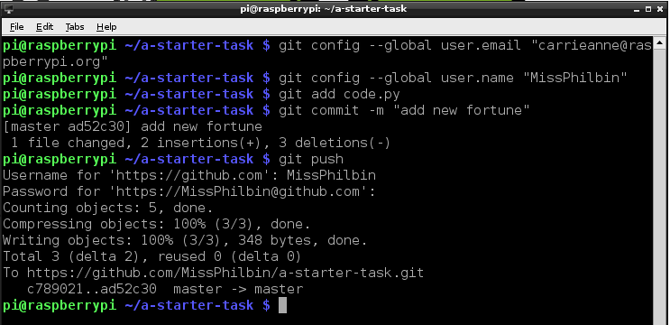
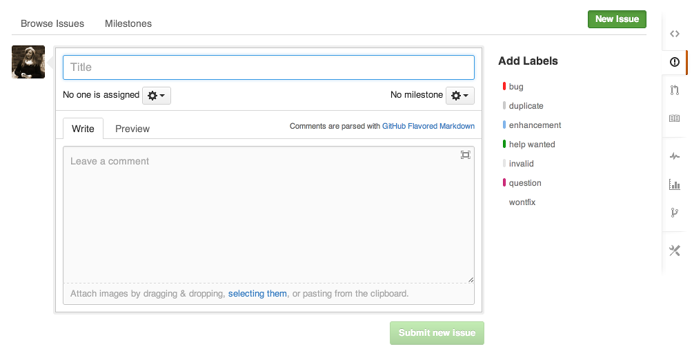

# A Starter Task for using GitHub in Education with Raspberry Pi

##Introduction

Interested in innovative ways to assess students work on Raspberry Pis in the classroom? Then github for education could provide a good answer. This tutorial will demonstrate how you could use github to give students some starter code to adapt, and how you can assess their changes.

##Step 1: Do you have a GitHub account?

Make sure that you have signed up for [GitHub here](https://github.com/). This [github cheat sheet may come in handy](https://education.github.com/git-cheat-sheet-education.pdf) too.

##Step 2: Make a copy of this *repository*

A repository is a type of folder on github. Making a copy of a respoistory is called **forking**. Click on the 'Fork' button at the top of the screen on the right hand side, and a copy of everything in this respoitory called **a-starter-task** will appear in your account.


##Step 3: Locate the code!

Now navigate back to your account and find the starter code called **code.py**. The code will look like this but will be in a text file:

```python
import random
import time

print("Welcome to my fortune teller")

question = input("Would you like me to tell your fortune?\n")
colour = input("What is your favourite colour?\n")

print("I will now select your fortune based on your selection of ", colour)
time.sleep(2)

fortunes = ["You win all the things",
			"Good things will happen if you learn to code"]
			
print(random.choice(fortunes))

```			

##Step 4: Copy the code to your Raspberry Pi

Now that you have the starter task repository in your github account, let's clone it to your Raspberry Pi to make the program better!

1. First setup your Raspberry Pi and log in. You can follow [the Raspberry Pi quick start guide here](http://www.raspberrypi.org/help/quick-start-guide/) if you are unsure how to do this. Once you have booted your pi, login.

	*Note: You will need to be connected to the internet in order to clone the repository to your Pi*

2. Either from the **command line** or from an **LXTerminal** window, type the following command to clone the github repository on your github account, and press **enter**:

	```
	git clone https://github.com/user/a-starter-task.git
	``` 
	*Note that you need to replace 'user' with your account name. e.g. MissPhilbin*

3. GitHub may ask you to log into your account at this point with your username and password.

4. Once your have cloned the repository you will see a new directory added to the Raspberry Pi file structure. This is the repo. You can change directory into it using `cd a-starter-task` and then type `ls` to see the files contained within it. These will include the code file which you want to chage called **code.py**.	

##Step 5: Change the code

With the starter code successfully cloned to your Raspberry Pi you will be able to change it up and add your own style/twist. 

1. If you are comfortable with using the command line, then you can use text editors like **nano** to adapt the code. Otherwise boot to the desktop by typing `startx`.
2. Open **IDLE3** by double clicking on the desktop icon. 
3. Click on **File** and **Open**
4. Naviagte to where you saved **code.py** to and select it.
5. Click **Open**
6. Now add some more fortune statements strings to the list at the bottom. Currently there are two, add at least 5 more.
7. When completed test your code works by saving it and clicking on **Run** followed by **Run Module**.

##Step 6: Upload the changed code to Github

1. Open an **LXTerminal** window by double clicking on the desktop icon.
2. Change directory to where your updated code file is located by typing `cd a-starter-task`.
2. Next configure your email address and name on your Raspberry Pi so that when you commit your changes you can see who made the commit. Type:

	```
	git config --global user.email "you@example.com"
	git config --global user.name "Your Name"
	```
3. Type `git add code.py` and press **enter**.
4. Then type `git commit -m "my commit message"`. *Note that the commit message acts as a note to remind you or collaborators about what you have done to the file.*
5. Finally type `git push` to finalise the commit to github. You will be asked for your github username and password in order to complete this step.



Another option, if your Raspberry Pi is not connected to the internet is to save your ammended code.py file onto a usb memory stick connected to the Pi. Then log into your github account with a computer or laptop and open the file by clicking on the **code.py** file in your forked repository. (Not our original!) Then click on **edit**. You can then paste your new code over the top from the file on the usb memory stick. To save your code you need to **commit** it to the repository. You will notice that there is a comment box in which you can give a description to the code that you have changed. Add an explanantion here and then click on **Commit Changes**.

##Step 7: Share and Comment

Follow [Ben](http://github.com/bennuttall) or [Carrie Anne](http://github.com/missphilbin) and anyone else from [Picademy](https://github.com/picademy). Then you will be able to see their forked repositories and their changed versions of code.py

You can comment on their work and give feedback by navigating to their forked respository and then clicking on the **issues** button on the right hand side of the screen. The icon looks like an exclamation mark in a circle. Then you can fill out a comment box and submit it. This could be a useful way for you to makr students work. 

You can also track the changes that students have made to the code in their repositories, by clicking on the **History** button on their file within their GitHub repo. 



##Step 8: Learn more about GitHub in Education

You can learn more about how to use [GitHub in Education here](https://education.github.com/guide). Including steps on administrating accounts for students. 
